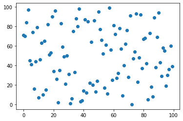
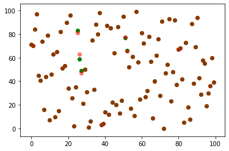
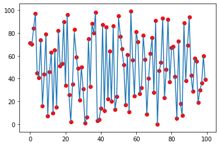

# Hashing with UAT
Implementation of hashing data structure with neural networks 

Hashing is an excellent data structure to store and retrieve data from an array. It makes data retrieval complexity as O(1). The problem with hashing is the "hashing function" output is bounded. So, there is a high probability that two unique elements could have the same hash value (collision). It makes the hashing concept unusable in practical use cases. There are several methods to overcome the collision. Here I present my version.
  
<b>Hashing</b> 
In general, a hash function maps the element to the respective index. A function f(x) where x is input element and output is its respective index. It's for faster retrieval of data.
  
<b>Neural Networks</b> 
Neural networks are excellent function approximators. Given (x,y) data points, it could approximate the continuous relation between x and y. This property of NN is Universal Approximation.
  
<b>Neural networks for hashing [My idea :)]</b> 
Let elements get stored in any order in the array. Let's say the following is the array <i>[10,15,4,1,5,90]</i> (Oh!! All elements should be unique in the array). The above array in terms of <i>(element, index)</i> pair is (10,0), (15,1), (4,2), (1,3), (5,4), (90,5). These data points used to train a neural network until it <i>overfits</i> the data points. Now, the trained neural network is a function that maps elements to the index. Voila!! A function to represent (element,index) relation without collision.
  
<b>Example</b> 
A dataset made through taking randomized 100 samples within [0,100] range. Following is the scatter plot data points element as x and index as y.
 

 
A neural network trained with the above dataset. All hyperparameters are arbitrary. "Overfitting" is made.Following is the scatter plot showing correlation with actual data points and output of the neural network. 
Green - Actual data points 
Red - Neural network output 

 
The above correlation had RMSE of 0.2(approx), the output of NN could be rounded to nearest integer val to get its actual index. The following shows a continuous plot for input [0,100]. 

  
<b>For other data formats</b>
 
This method is fine with any data format array. As long as the elements in the array could represent a unique number. The element x into g(x) function, it makes sure all elements in array get a unique number. The rest is number to respective index (As we discussed above). As long as the function g(x) concerns, It could be SHA-1(x) outputs a 160-bit binary string. Convert to number form and proceed with training the neural network. SHA-1 does have collision issues. Otherwise, an RNN stocked with a traditional neural network is trained for the purpose [Easier].

  
<b>Summary</b> 
There is no mathematical proof to determine no of layers to use for training. It's arbitrary till now. So, we cant deduce proofs for complexity.
